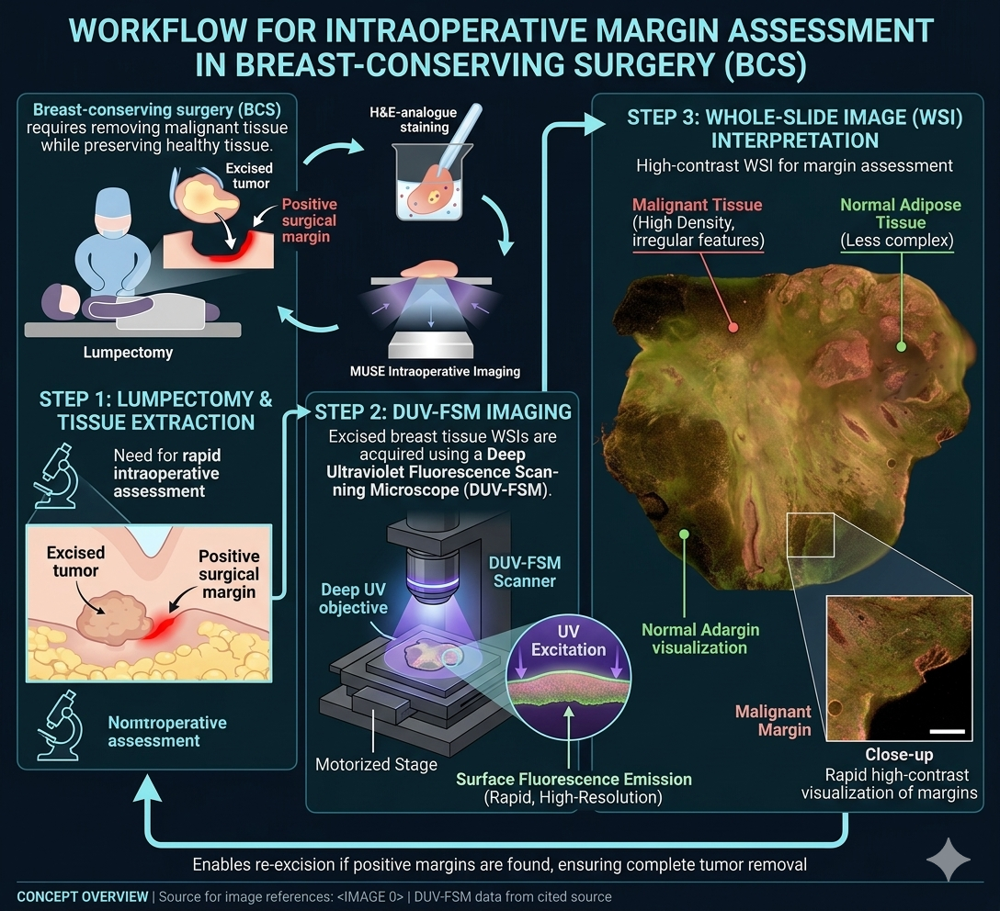
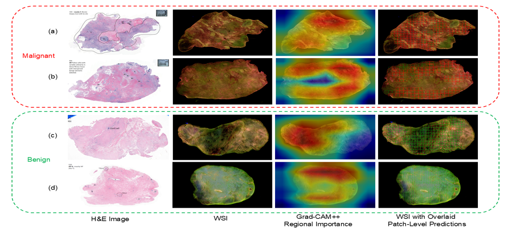
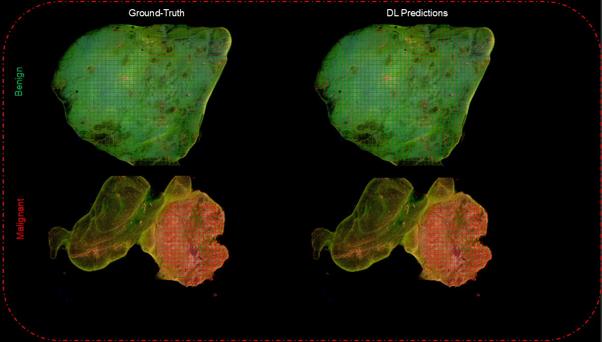

# Breast Cancer Classification in Deep Ultraviolet Fluorescence Images Using a Patch-Level Vision Transformer Framework

This repository implements the framework proposed in the paper:

*Breast Cancer Classification in Deep Ultraviolet Fluorescence Images Using a Patch-Level Vision Transformer Framework*

Accepted at the **47th Annual International Conference of the IEEE Engineering in Medicine and Biology Society (EMBC 2025)**, Copenhagen, Denmark (https://embc.embs.org/2025/about/).

[IEEE PDF](https://ieeexplore.ieee.org/abstract/document/11253275)  
[ResearchGate PDF](https://www.researchgate.net/publication/398306055_Breast_Cancer_Classification_in_Deep_Ultraviolet_Fluorescence_Images_Using_a_Patch-Level_Vision_Transformer_Framework)

Currently, the related code repository from our group is available at:

https://github.com/Yatagarasu50469/RANDS


---

## **Authors & Affiliations**

**Pouya Afshin, David Helminiak, Tongtong Lu, Tina Yen, Julie M. Jorns, Mollie Patton, Bing Yu, Dong Hye Ye 

1. Department of Computer Science, Georgia State University  
2. Department of Electrical and Computer Engineering, Marquette University  
3. Department of Bioengineering, Marquette University  
4. Department of Surgery, Medical College of Wisconsin  
5. Department of Pathology, Medical College of Wisconsin  


---

## **Project Overview**

Breast-conserving surgery (BCS) requires removing malignant tissue while preserving healthy tissue.  



Whole-slide images (WSIs) of excised breast tissue are acquired using a deep ultraviolet fluorescence scanning microscope (DUV-FSM), which provides high-contrast visualization of malignant and normal regions.


A patch-level Vision Transformer (ViT) framework is employed to address the challenges posed by high-resolution images and complex histopathology. Both local and global features are captured by the model to enable robust breast cancer classification. Additionally, Grad-CAM++ is used to generate saliency-based visualizations that highlight diagnostically relevant regions and enhance interpretability. The approach is evaluated using 5-fold cross-validation, and its performance is shown to surpass conventional deep learning methods, achieving a classification accuracy of 98.33% for distinguishing benign and malignant tissue.

---

## Pipeline: DUV WSI Classification


1. Divide each DUV WSI into non-overlapping patches.

2. Subdivide each patch into smaller sub-patches and transform them into learnable position and class embeddings.

3. Pass embeddings through the Vision Transformer (ViT) encoder to update class embeddings.

4. Classify each patch using the MLP head.

5. Generate Grad-CAM++ maps with a fine-tuned CNN to obtain patch-level importance weights.

6. Fuse patch-level predictions with Grad-CAM++ weights to obtain the final WSI-level classification.

# Qualitative Results



Visualization of DUV WSIs with their corresponding H&E images, Grad-CAM++ saliency maps, and Patch-level predictions. Cases (a) and (b)
show malignant samples, while (c) and (d) represent benign ones. ViT outperforms CNNs in patch-level predictions, accurately determining patch labels in
most cases. While the ViT misclassified some patches in (b) and (c), their impact was mitigated by Grad-CAM++ saliency scores. The proposed method
refines WSI classification by heavily weighting diagnostically important regions and de-emphasizing less critical areas.



Visualization of patch-level predictions overlaid on the WSI images. As shown, the model could distinguish between benign and malignant patches well.

## Running

1. Generate patch-level metadata with Grad-CAM++ ---> To prepare the patch-level dataset, create metadata for your class dataset and generate patch-level saliency scores using Grad-CAM++:

```
Grad-CAM++/Densenet_Grad-CAM-Full_Batch1_GradCAM++.ipynb
```
This will produce: metadata_patches_with_grad_cam++_binary_label.csv --> The CSV contains patch information and corresponding Grad-CAM++ saliency scores required by main.py.

2. Run the main training script

After generating the metadata, simply run:

```
python3 main.py --model_type ViT-B_16 --fp16 --fp16_opt_level O2
```

This will start training and evaluation at both the patch and WSI levels using 5-fold cross-validation.

> **Note:** This is the updated version of the code. Many things have been modified in comparison to the original implementation. The manual binary threshold in the paper has been replaced with automatic thresholding based on patches from the training set.

## Installation & Requirements

Clone the repository:

```
git clone https://github.com/pouya1212/DUV-Patch-ViT-BreastCancer
cd DUV-Patch-ViT-BreastCancer
```
Install required dependencies:

```
---pip install -r requirements.txt

```
---

## Dataset

The dataset includes **60 DUV WSIs** (24 benign, 36 malignant) collected from the **Medical College of Wisconsin**. 


A total of **34,468 non-overlapping 400×400 patches** were extracted:
- 9,444 malignant patches  
- 25,024 benign patches


Patch labels were obtained from pathologist annotations.

> **Note:** We are sharing earlier versions of Dataset 1 through Hugging Face:

https://huggingface.co/datasets/BLISS-MU/DDSM

> ---
## Acknowledgements

The Vision Transformer (ViT) implementation used in this repository is adapted from the following open-source project:

https://github.com/jeonsworld/ViT-pytorch

The original implementation was modified to support loading pretrained models trained on large-scale public datasets and to integrate them into our training pipeline for DUV-FSM breast cancer classification.
---
## Citation

If you find this work useful, please cite:

```bibtex
@inproceedings{afshin2025duvvit,
  author    = {Pouya Afshin and David Helminiak and Tongtong Lu and Tina Yen and 
               Julie M. Jorns and Mollie Patton and Bing Yu and Dong Hye Ye},
  title     = {Breast Cancer Classification in Deep Ultraviolet Fluorescence Images 
               Using a Patch-Level Vision Transformer Framework},
  booktitle = {Proceedings of the 47th Annual International Conference of the 
               IEEE Engineering in Medicine and Biology Society (EMBC)},
  year      = {2025},
  pages     = {1--6},
  doi       = {10.1109/EMBC58623.2025.11253275}
}
