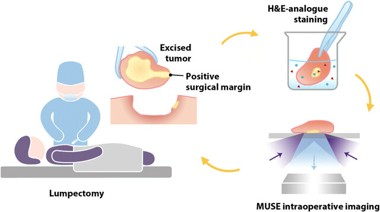
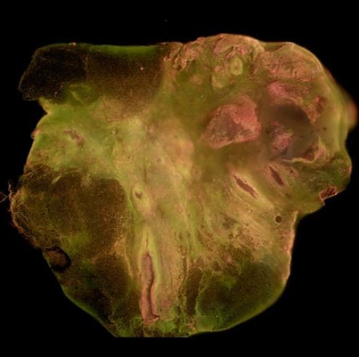
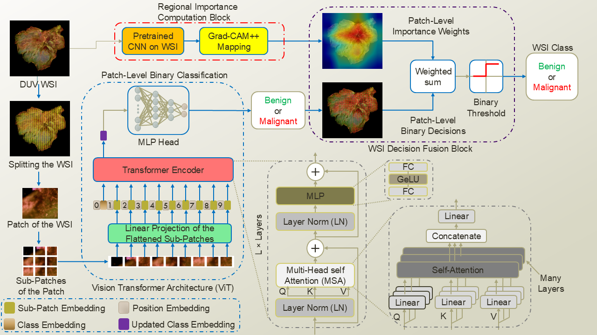
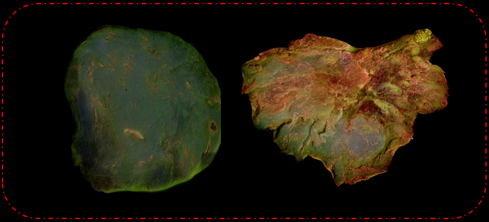
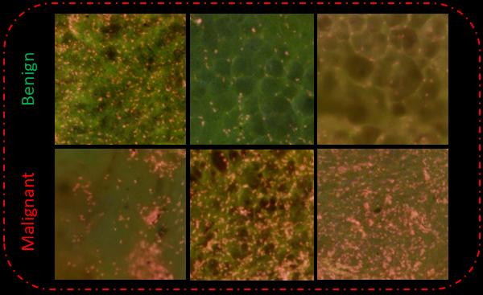

# Breast Cancer Classification in Deep Ultraviolet Fluorescence Images Using a Patch-Level Vision Transformer Framework

This repository implements the framework proposed in:

*Breast Cancer Classification in Deep Ultraviolet Fluorescence Images Using a Patch-Level Vision Transformer Framework*  
[PDF_Link_IEEE](https://ieeexplore.ieee.org/abstract/document/11253275)
[PDF link](https://www.researchgate.net/publication/398306055_Breast_Cancer_Classification_in_Deep_Ultraviolet_Fluorescence_Images_Using_a_Patch-Level_Vision_Transformer_Framework)


---

## **Authors & Affiliations**

**Pouya Afshin, David Helminiak, Tongtong Lu, Tina Yen, Julie M. Jorns, Mollie Patton, Bing Yu, Dong Hye Ye 

1. Department of Computer Science, Georgia State University  
2. Department of Electrical and Computer Engineering, Marquette University  
3. Department of Bioengineering, Marquette University  
4. Department of Surgery, Medical College of Wisconsin  
5. Department of Pathology, Medical College of Wisconsin  


---

## **Project Overview**

Breast-conserving surgery (BCS) requires removing malignant tissue while preserving healthy tissue.  



Whole-slide images (WSIs) of excised breast tissue are acquired using a deep ultraviolet fluorescence scanning microscope (DUV-FSM), which provides high-contrast visualization of malignant and normal regions.



A patch-level Vision Transformer (ViT) framework is employed to address the challenges posed by high-resolution images and complex histopathology. Both local and global features are captured by the model to enable robust breast cancer classification. Additionally, Grad-CAM++ is used to generate saliency-based visualizations that highlight diagnostically relevant regions and enhance interpretability. The approach is evaluated using 5-fold cross-validation, and its performance is shown to surpass conventional deep learning methods, achieving a classification accuracy of 98.33% for distinguishing benign and malignant tissue.

---

## Pipeline: DUV WSI Classification



1. Divide each DUV WSI into non-overlapping patches.

2. Subdivide each patch into smaller sub-patches and transform them into learnable position and class embeddings.

3. Pass embeddings through the Vision Transformer (ViT) encoder to update class embeddings.

4. Classify each patch using the MLP head.

5. Generate Grad-CAM++ maps with a fine-tuned CNN to obtain patch-level importance weights.

6. Fuse patch-level predictions with Grad-CAM++ weights to obtain the final WSI-level classification.

## Installation & Requirements

Clone the repository:

git clone https://github.com/pouya12/ssl-guided-ldm-duv-breast-cancer.git
cd ssl-guided-ldm-duv-breast-cancer

Install required dependencies:

pip install -r requirements.txt

---

## Dataset

The dataset includes **142 DUV WSIs** (58 benign, 84 malignant) collected from the **Medical College of Wisconsin**. 



A total of **172,984 non-overlapping 400×400 patches** were extracted:
- 48,619 malignant patches  
- 124,365 benign patches



Patch labels were obtained from pathologist annotations.

> **Note:** Researchers interested in accessing the dataset may contact the Medical College of Wisconsin and Marquette University for potential collaboration or data sharing.
> ---
## Acknowledgements

The Vision Transformer (ViT) implementation used in this repository is adapted from the following open-source project:

https://github.com/jeonsworld/ViT-pytorch

The original implementation was modified to support loading pretrained models trained on large-scale public datasets and to integrate them into our training pipeline for DUV-FSM breast cancer classification.
---
## Citation

If you find this work useful, please cite:

```bibtex
@INPROCEEDINGS{11253275,
  author={Afshin, Pouya and Helminiak, David and Lu, Tongtong and Yen, Tina and Jorns, Julie M. and Patton, Mollie and Yu, Bing and Ye, Dong Hye},
  booktitle={2025 47th Annual International Conference of the IEEE Engineering in Medicine and Biology Society (EMBC)}, 
  title={Breast Cancer Classification in Deep Ultraviolet Fluorescence Images Using a Patch-Level Vision Transformer Framework}, 
  year={2025},
  volume={},
  number={},
  pages={1-6},
  keywords={Deep learning;Computer vision;Accuracy;Computational modeling;Surgery;Fluorescence;Transformers;Feature extraction;Breast cancer;Computational efficiency},
  doi={10.1109/EMBC58623.2025.11253275}}

